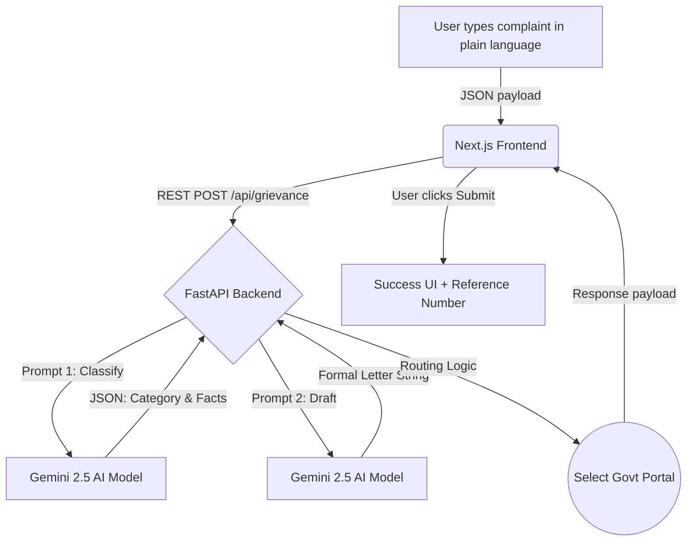

<div align="center">
  
  
  
</div>

<br>

<h1 align="center">GrievanceGPT</h1>
<h3 align="center">Your Voice. Filed. Followed Up. Automatically.</h3>

---

## 💡 About the Project

**GrievanceGPT** is an Agentic AI system built for the **Hack & Break 2026** competition under the **Agentic AI** theme. 

Millions of citizens face legitimate grievances (overcharged bills, broken infrastructure, RTI requests) but give up before filing because government portals are complex, bureaucratic, and jargon-heavy. 

GrievanceGPT entirely removes this barrier. A citizen simply types their problem in plain language. The AI agent:
1. **Understands & Classifies** the grievance type.
2. **Routes** it to the correct government portal (e.g., CPGRAMS, PGPortal, Consumer Forum).
3. **Drafts** a formal, legally appropriate complaint letter.
4. **Submits** the grievance and returns a tracking reference number.

This is a true demonstration of Agentic AI—planning, reasoning, and executing real-world actions with minimal human intervention.

---

## Demo
https://github.com/user-attachments/assets/cc6fc49b-c406-4187-93a7-3b2da73b5772

## 🛠️ Tech Stack

### Frontend


### Backend & AI Agent


---

## 🏛️ System Architecture



---

## 🚀 How to Run Locally

This project is split into a Python backend and a Next.js frontend. You will need two terminals running simultaneously.

### Prerequisites
- Node.js (v18+)
- Python (3.10+)
- A Google Gemini API Key added to `backend/.env`

### 1. Start the Backend API (Terminal 1)
```bash
cd backend
pip install -r requirements.txt
python -m uvicorn main:app --reload --port 8000
```
*Runs on http://localhost:8000*

### 2. Start the Frontend UI (Terminal 2)
```bash
cd frontend
npm install
npm run dev
```
*Runs on http://localhost:3000*

### 3. Usage
Open [http://localhost:3000](http://localhost:3000) in your browser. Type a sample complaint like:
> *"My electricity bill was double this month with no explanation. I usually pay ₹800 but got a bill of ₹2400."*

Click **Analyze with AI** and watch the agent classify, route, and draft the formal letter in seconds.
